# Field types

Every field has a type, named by the first argument of `field()`. The second argument holds that
type's options:

```ts
// collections/Posts.ts
import { defineCollection, field } from 'ohnejs';

export default defineCollection({
  fields: {
    title: field('text', { max: 120 }),
    status: field('select', { choices: ['draft', 'published'] }),
  },
});
```

This page lists every type ohne ships, with all the options each one takes.
[Collections and fields](./collections.md) shows how the types work together, and
[custom field types](./custom-field-types.md) shows how to add your own.

Types and options are sorted alphabetically. The default is what an omitted option resolves to. A
`-` means the option stays unset, and "required" means the `field()` call does not type-check
without it.

## Built-in types

These are part of the framework, so every app has them.

### `blocks`

<picture>
  <source media="(prefers-color-scheme: dark)" srcset="../images/field-types/blocks-dark.png">
  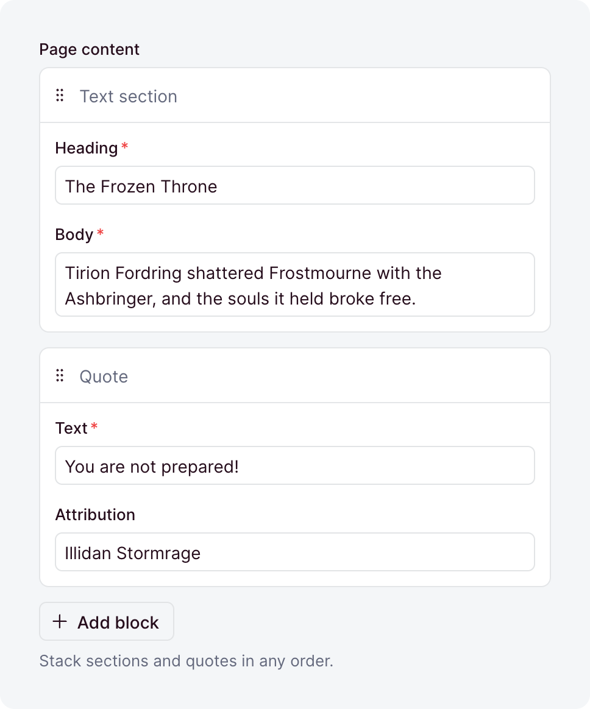
</picture>

An ordered list of mixed, reusable shapes, each defined once under `blocks/`. [Blocks](./blocks.md)
covers them in depth.

| Option         | Default | What it does                                                                                                                                                            |
| -------------- | ------- | ----------------------------------------------------------------------------------------------------------------------------------------------------------------------- |
| `allow`        | -       | The block types the field may hold. Omitted, it accepts every block the app defines.                                                                                    |
| `allowEmpty`   | `true`  | Accepts an empty list. With `false`, a written `[]` is rejected, so the field needs at least one block.                                                                 |
| `default`      | `[]`    | A function that returns the list a [create](./writing.md#defaults) stores when its input leaves the field out.                                                          |
| `description`  | -       | Help text below the label, as markdown. A string, a [message key](../i18n/messages.md), or an [object](./collections.md#dashboard-appearance) that starts it collapsed. |
| `immutable`    | `false` | Locks the field after create: creates accept it, updates reject it. Top-level collection fields only.                                                                   |
| `label`        | -       | The label the dashboard shows, as a string or a [message key](../i18n/messages.md). Omitted, the field name is sentence-cased.                                          |
| `readable`     | `true`  | `false` makes the field [write-only](./collections.md#write-only-and-locked-fields): no read returns it.                                                                |
| `sanitizers`   | -       | Functions that [clean the value](./writing.md#sanitizers-and-validators) before it is validated.                                                                        |
| `search`       | `true`  | `false` keeps [search](./collections.md#search) from looking inside the blocks.                                                                                         |
| `translatable` | `false` | Keeps [one list per locale](./translations.md#marking-fields). Top-level collection fields only.                                                                        |
| `validators`   | -       | Functions that [reject a value](./writing.md#sanitizers-and-validators) by returning a message.                                                                         |
| `when`         | -       | A [condition](./conditional-fields.md) that turns the field on or off per record.                                                                                       |
| `writable`     | `true`  | `false` removes the field from write inputs, so its value comes from `default`.                                                                                         |

### `boolean`

<picture>
  <source media="(prefers-color-scheme: dark)" srcset="../images/field-types/boolean-dark.png">
  
</picture>

`true` or `false`.

| Option            | Default      | What it does                                                                                                                                                            |
| ----------------- | ------------ | ----------------------------------------------------------------------------------------------------------------------------------------------------------------------- |
| `default`         | -            | The value a [create](./writing.md#defaults) stores when its input leaves the field out. A value, or a function that computes one.                                       |
| `description`     | -            | Help text below the label, as markdown. A string, a [message key](../i18n/messages.md), or an [object](./collections.md#dashboard-appearance) that starts it collapsed. |
| `display`         | `'checkbox'` | The editor: `'checkbox'`, `'switch'`, or `'buttons'`. The stored value is the same either way.                                                                          |
| `falseLabel`      | -            | The `false` button's label under `display: 'buttons'`, as a string or a [message key](../i18n/messages.md). Omitted, it reads "No".                                     |
| `immutable`       | `false`      | Locks the field after create: creates accept it, updates reject it. Top-level collection fields only.                                                                   |
| `index`           | `false`      | Adds an index on the column, for faster lookups.                                                                                                                        |
| `label`           | -            | The label the dashboard shows, as a string or a [message key](../i18n/messages.md). Omitted, the field name is sentence-cased.                                          |
| `nullable`        | `false`      | Lets the field hold `null`.                                                                                                                                             |
| `readable`        | `true`       | `false` makes the field [write-only](./collections.md#write-only-and-locked-fields): no read returns it.                                                                |
| `sanitizers`      | -            | Functions that [clean the value](./writing.md#sanitizers-and-validators) before it is validated.                                                                        |
| `search`          | `false`      | A boolean has nothing for [search](./collections.md#search) to match, so `true` fails at boot.                                                                          |
| `translatable`    | `false`      | Keeps [one value per locale](./translations.md#marking-fields). Top-level collection fields only.                                                                       |
| `trueLabel`       | -            | The `true` button's label under `display: 'buttons'`, as a string or a [message key](../i18n/messages.md). Omitted, it reads "Yes".                                     |
| `unique`          | `false`      | Rejects a value that another row already holds.                                                                                                                         |
| `uniquePerLocale` | `false`      | Limits `unique` to one locale. Needs `unique` and `translatable`.                                                                                                       |
| `uniquePerParent` | `false`      | Limits `unique` to each record's own list, inside a repeater. Needs `unique`.                                                                                           |
| `validators`      | -            | Functions that [reject a value](./writing.md#sanitizers-and-validators) by returning a message.                                                                         |
| `when`            | -            | A [condition](./conditional-fields.md) that turns the field on or off per record.                                                                                       |
| `writable`        | `true`       | `false` removes the field from write inputs, so its value comes from `default`.                                                                                         |

### `date`

<picture>
  <source media="(prefers-color-scheme: dark)" srcset="../images/field-types/date-dark.png">
  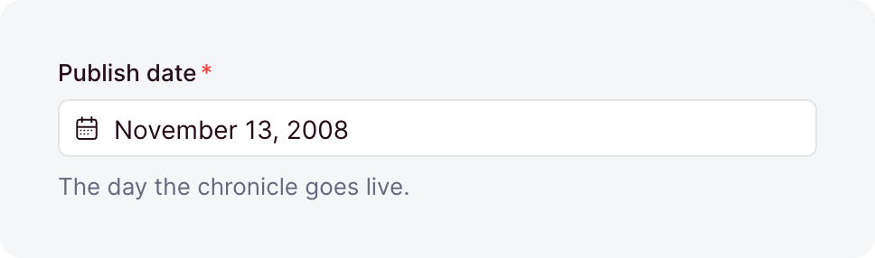
</picture>

A calendar day, stored as `YYYY-MM-DD` text. No time zone is involved.

| Option            | Default | What it does                                                                                                                                                            |
| ----------------- | ------- | ----------------------------------------------------------------------------------------------------------------------------------------------------------------------- |
| `default`         | -       | The value a [create](./writing.md#defaults) stores when its input leaves the field out. A value, or a function that computes one.                                       |
| `description`     | -       | Help text below the label, as markdown. A string, a [message key](../i18n/messages.md), or an [object](./collections.md#dashboard-appearance) that starts it collapsed. |
| `immutable`       | `false` | Locks the field after create: creates accept it, updates reject it. Top-level collection fields only.                                                                   |
| `index`           | `false` | Adds an index on the column, for faster lookups.                                                                                                                        |
| `label`           | -       | The label the dashboard shows, as a string or a [message key](../i18n/messages.md). Omitted, the field name is sentence-cased.                                          |
| `max`             | -       | The latest day, as `YYYY-MM-DD`.                                                                                                                                        |
| `min`             | -       | The earliest day, as `YYYY-MM-DD`.                                                                                                                                      |
| `nullable`        | `false` | Lets the field hold `null`.                                                                                                                                             |
| `placeholder`     | -       | The hint an empty input shows, as a string or a [message key](../i18n/messages.md).                                                                                     |
| `readable`        | `true`  | `false` makes the field [write-only](./collections.md#write-only-and-locked-fields): no read returns it.                                                                |
| `sanitizers`      | -       | Functions that [clean the value](./writing.md#sanitizers-and-validators) before it is validated.                                                                        |
| `search`          | `true`  | Lets [search](./collections.md#search) match the field. A year, month, or day like `2024-06` finds the days it starts.                                                  |
| `translatable`    | `false` | Keeps [one value per locale](./translations.md#marking-fields). Top-level collection fields only.                                                                       |
| `unique`          | `false` | Rejects a value that another row already holds.                                                                                                                         |
| `uniquePerLocale` | `false` | Limits `unique` to one locale. Needs `unique` and `translatable`.                                                                                                       |
| `uniquePerParent` | `false` | Limits `unique` to each record's own list, inside a repeater. Needs `unique`.                                                                                           |
| `validators`      | -       | Functions that [reject a value](./writing.md#sanitizers-and-validators) by returning a message.                                                                         |
| `when`            | -       | A [condition](./conditional-fields.md) that turns the field on or off per record.                                                                                       |
| `writable`        | `true`  | `false` removes the field from write inputs, so its value comes from `default`.                                                                                         |

### `dateTime`

<picture>
  <source media="(prefers-color-scheme: dark)" srcset="../images/field-types/date-time-dark.png">
  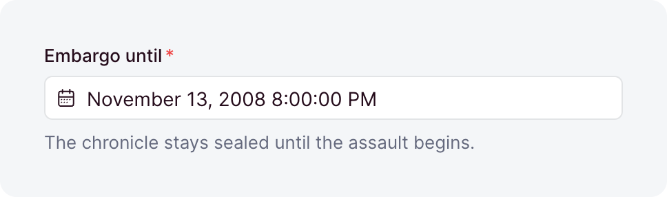
</picture>

An instant, stored as epoch milliseconds. A write takes that number only, so convert a `Date` with
`getTime()` first. The dashboard shows it in the viewer's time zone.

| Option            | Default | What it does                                                                                                                                                            |
| ----------------- | ------- | ----------------------------------------------------------------------------------------------------------------------------------------------------------------------- |
| `default`         | -       | The value a [create](./writing.md#defaults) stores when its input leaves the field out. A value, or a function that computes one.                                       |
| `description`     | -       | Help text below the label, as markdown. A string, a [message key](../i18n/messages.md), or an [object](./collections.md#dashboard-appearance) that starts it collapsed. |
| `immutable`       | `false` | Locks the field after create: creates accept it, updates reject it. Top-level collection fields only.                                                                   |
| `index`           | `false` | Adds an index on the column, for faster lookups.                                                                                                                        |
| `label`           | -       | The label the dashboard shows, as a string or a [message key](../i18n/messages.md). Omitted, the field name is sentence-cased.                                          |
| `max`             | -       | The latest instant, as epoch milliseconds or an ISO 8601 string.                                                                                                        |
| `min`             | -       | The earliest instant, as epoch milliseconds or an ISO 8601 string.                                                                                                      |
| `nullable`        | `false` | Lets the field hold `null`.                                                                                                                                             |
| `placeholder`     | -       | The hint an empty input shows, as a string or a [message key](../i18n/messages.md).                                                                                     |
| `readable`        | `true`  | `false` makes the field [write-only](./collections.md#write-only-and-locked-fields): no read returns it.                                                                |
| `relativeTime`    | `false` | Shows the instant as elapsed time, like "2 hours ago", with the exact date on hover.                                                                                    |
| `sanitizers`      | -       | Functions that [clean the value](./writing.md#sanitizers-and-validators) before it is validated.                                                                        |
| `search`          | `false` | An instant has nothing for [search](./collections.md#search) to match, so `true` fails at boot.                                                                         |
| `timezone`        | -       | A fixed IANA zone the dashboard shows and edits the instant in. Omitted, the viewer's own zone applies.                                                                 |
| `translatable`    | `false` | Keeps [one value per locale](./translations.md#marking-fields). Top-level collection fields only.                                                                       |
| `unique`          | `false` | Rejects a value that another row already holds.                                                                                                                         |
| `uniquePerLocale` | `false` | Limits `unique` to one locale. Needs `unique` and `translatable`.                                                                                                       |
| `uniquePerParent` | `false` | Limits `unique` to each record's own list, inside a repeater. Needs `unique`.                                                                                           |
| `validators`      | -       | Functions that [reject a value](./writing.md#sanitizers-and-validators) by returning a message.                                                                         |
| `when`            | -       | A [condition](./conditional-fields.md) that turns the field on or off per record.                                                                                       |
| `writable`        | `true`  | `false` removes the field from write inputs, so its value comes from `default`.                                                                                         |

### `integer`

<picture>
  <source media="(prefers-color-scheme: dark)" srcset="../images/field-types/integer-dark.png">
  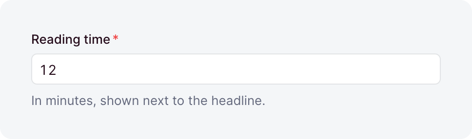
</picture>

A whole number within JavaScript's safe range. For money, store minor units like cents.

| Option            | Default | What it does                                                                                                                                                            |
| ----------------- | ------- | ----------------------------------------------------------------------------------------------------------------------------------------------------------------------- |
| `default`         | -       | The value a [create](./writing.md#defaults) stores when its input leaves the field out. A value, or a function that computes one.                                       |
| `description`     | -       | Help text below the label, as markdown. A string, a [message key](../i18n/messages.md), or an [object](./collections.md#dashboard-appearance) that starts it collapsed. |
| `immutable`       | `false` | Locks the field after create: creates accept it, updates reject it. Top-level collection fields only.                                                                   |
| `index`           | `false` | Adds an index on the column, for faster lookups.                                                                                                                        |
| `label`           | -       | The label the dashboard shows, as a string or a [message key](../i18n/messages.md). Omitted, the field name is sentence-cased.                                          |
| `max`             | -       | The largest value.                                                                                                                                                      |
| `min`             | -       | The smallest value.                                                                                                                                                     |
| `nullable`        | `false` | Lets the field hold `null`.                                                                                                                                             |
| `placeholder`     | -       | The hint an empty input shows, as a string or a [message key](../i18n/messages.md).                                                                                     |
| `readable`        | `true`  | `false` makes the field [write-only](./collections.md#write-only-and-locked-fields): no read returns it.                                                                |
| `sanitizers`      | -       | Functions that [clean the value](./writing.md#sanitizers-and-validators) before it is validated.                                                                        |
| `search`          | `false` | `true` lets [search](./collections.md#search) find the exact number, like `1042`.                                                                                       |
| `translatable`    | `false` | Keeps [one value per locale](./translations.md#marking-fields). Top-level collection fields only.                                                                       |
| `unique`          | `false` | Rejects a value that another row already holds.                                                                                                                         |
| `uniquePerLocale` | `false` | Limits `unique` to one locale. Needs `unique` and `translatable`.                                                                                                       |
| `uniquePerParent` | `false` | Limits `unique` to each record's own list, inside a repeater. Needs `unique`.                                                                                           |
| `validators`      | -       | Functions that [reject a value](./writing.md#sanitizers-and-validators) by returning a message.                                                                         |
| `when`            | -       | A [condition](./conditional-fields.md) that turns the field on or off per record.                                                                                       |
| `writable`        | `true`  | `false` removes the field from write inputs, so its value comes from `default`.                                                                                         |

### `link`

<picture>
  <source media="(prefers-color-scheme: dark)" srcset="../images/field-types/link-dark.png">
  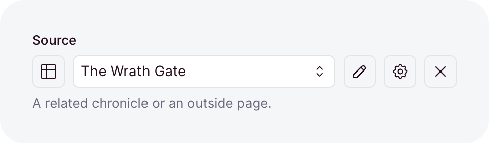
</picture>

One link to an address or to a record, stored as JSON. [Rich text](./rich-text.md#the-link-field)
covers its value and how a record link is checked.

| Option            | Default | What it does                                                                                                                                                            |
| ----------------- | ------- | ----------------------------------------------------------------------------------------------------------------------------------------------------------------------- |
| `collections`     | -       | The collections whose records the field may link to. Omitted, only addresses are allowed.                                                                               |
| `default`         | -       | The value a [create](./writing.md#defaults) stores when its input leaves the field out. A value, or a function that computes one.                                       |
| `description`     | -       | Help text below the label, as markdown. A string, a [message key](../i18n/messages.md), or an [object](./collections.md#dashboard-appearance) that starts it collapsed. |
| `immutable`       | `false` | Locks the field after create: creates accept it, updates reject it. Top-level collection fields only.                                                                   |
| `index`           | `false` | Adds an index on the column, for faster lookups.                                                                                                                        |
| `label`           | -       | The label the dashboard shows, as a string or a [message key](../i18n/messages.md). Omitted, the field name is sentence-cased.                                          |
| `nullable`        | `false` | Lets the field hold `null`.                                                                                                                                             |
| `placeholder`     | -       | The hint an empty input shows, as a string or a [message key](../i18n/messages.md).                                                                                     |
| `readable`        | `true`  | `false` makes the field [write-only](./collections.md#write-only-and-locked-fields): no read returns it.                                                                |
| `sanitizers`      | -       | Functions that [clean the value](./writing.md#sanitizers-and-validators) before it is validated.                                                                        |
| `search`          | `false` | Locked: [search](./collections.md#search) never matches a link, and `true` fails at boot.                                                                               |
| `translatable`    | `false` | Keeps [one value per locale](./translations.md#marking-fields). Top-level collection fields only.                                                                       |
| `unique`          | `false` | Rejects a value that another row already holds.                                                                                                                         |
| `uniquePerLocale` | `false` | Limits `unique` to one locale. Needs `unique` and `translatable`.                                                                                                       |
| `uniquePerParent` | `false` | Limits `unique` to each record's own list, inside a repeater. Needs `unique`.                                                                                           |
| `validators`      | -       | Functions that [reject a value](./writing.md#sanitizers-and-validators) by returning a message.                                                                         |
| `when`            | -       | A [condition](./conditional-fields.md) that turns the field on or off per record.                                                                                       |
| `writable`        | `true`  | `false` removes the field from write inputs, so its value comes from `default`.                                                                                         |

### `multiSelect`

<picture>
  <source media="(prefers-color-scheme: dark)" srcset="../images/field-types/multi-select-dark.png">
  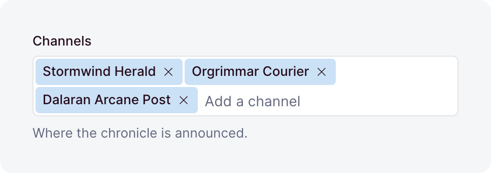
</picture>

An ordered list of distinct strings, stored as a JSON list. Duplicates are removed on write.

| Option            | Default | What it does                                                                                                                                                            |
| ----------------- | ------- | ----------------------------------------------------------------------------------------------------------------------------------------------------------------------- |
| `choices`         | -       | The values each entry must come from. Each is a string, or `{ value, label }`. Omitted, any strings are accepted.                                                       |
| `default`         | `[]`    | The list a [create](./writing.md#defaults) stores when its input leaves the field out. A value, or a function that computes one.                                        |
| `description`     | -       | Help text below the label, as markdown. A string, a [message key](../i18n/messages.md), or an [object](./collections.md#dashboard-appearance) that starts it collapsed. |
| `immutable`       | `false` | Locks the field after create: creates accept it, updates reject it. Top-level collection fields only.                                                                   |
| `index`           | `false` | Adds an index on the column, for faster lookups.                                                                                                                        |
| `label`           | -       | The label the dashboard shows, as a string or a [message key](../i18n/messages.md). Omitted, the field name is sentence-cased.                                          |
| `max`             | -       | The most entries the list may hold.                                                                                                                                     |
| `min`             | -       | The fewest entries the list may hold.                                                                                                                                   |
| `nullable`        | `false` | Lets the field hold `null`.                                                                                                                                             |
| `placeholder`     | -       | The hint an empty input shows, as a string or a [message key](../i18n/messages.md).                                                                                     |
| `readable`        | `true`  | `false` makes the field [write-only](./collections.md#write-only-and-locked-fields): no read returns it.                                                                |
| `sanitizers`      | -       | Functions that [clean the value](./writing.md#sanitizers-and-validators) before it is validated.                                                                        |
| `search`          | `true`  | Lets [search](./collections.md#search) match the field: a word of a choice's value or label, or the exact entry without `choices`.                                      |
| `translatable`    | `false` | Keeps [one value per locale](./translations.md#marking-fields). Top-level collection fields only.                                                                       |
| `unique`          | `false` | Rejects a value that another row already holds.                                                                                                                         |
| `uniquePerLocale` | `false` | Limits `unique` to one locale. Needs `unique` and `translatable`.                                                                                                       |
| `uniquePerParent` | `false` | Limits `unique` to each record's own list, inside a repeater. Needs `unique`.                                                                                           |
| `validators`      | -       | Functions that [reject a value](./writing.md#sanitizers-and-validators) by returning a message.                                                                         |
| `when`            | -       | A [condition](./conditional-fields.md) that turns the field on or off per record.                                                                                       |
| `writable`        | `true`  | `false` removes the field from write inputs, so its value comes from `default`.                                                                                         |

### `number`

<picture>
  <source media="(prefers-color-scheme: dark)" srcset="../images/field-types/number-dark.png">
  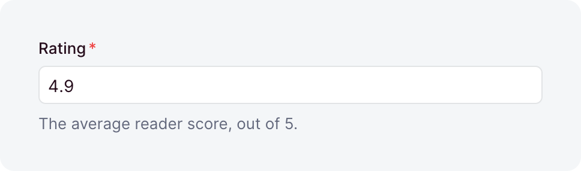
</picture>

A finite decimal, exactly like a JavaScript number. `NaN` and the infinities are rejected.

| Option            | Default | What it does                                                                                                                                                            |
| ----------------- | ------- | ----------------------------------------------------------------------------------------------------------------------------------------------------------------------- |
| `default`         | -       | The value a [create](./writing.md#defaults) stores when its input leaves the field out. A value, or a function that computes one.                                       |
| `description`     | -       | Help text below the label, as markdown. A string, a [message key](../i18n/messages.md), or an [object](./collections.md#dashboard-appearance) that starts it collapsed. |
| `immutable`       | `false` | Locks the field after create: creates accept it, updates reject it. Top-level collection fields only.                                                                   |
| `index`           | `false` | Adds an index on the column, for faster lookups.                                                                                                                        |
| `label`           | -       | The label the dashboard shows, as a string or a [message key](../i18n/messages.md). Omitted, the field name is sentence-cased.                                          |
| `max`             | -       | The largest value.                                                                                                                                                      |
| `min`             | -       | The smallest value.                                                                                                                                                     |
| `nullable`        | `false` | Lets the field hold `null`.                                                                                                                                             |
| `placeholder`     | -       | The hint an empty input shows, as a string or a [message key](../i18n/messages.md).                                                                                     |
| `readable`        | `true`  | `false` makes the field [write-only](./collections.md#write-only-and-locked-fields): no read returns it.                                                                |
| `sanitizers`      | -       | Functions that [clean the value](./writing.md#sanitizers-and-validators) before it is validated.                                                                        |
| `search`          | `false` | `true` lets [search](./collections.md#search) find the exact number, like `1.5`.                                                                                        |
| `translatable`    | `false` | Keeps [one value per locale](./translations.md#marking-fields). Top-level collection fields only.                                                                       |
| `unique`          | `false` | Rejects a value that another row already holds.                                                                                                                         |
| `uniquePerLocale` | `false` | Limits `unique` to one locale. Needs `unique` and `translatable`.                                                                                                       |
| `uniquePerParent` | `false` | Limits `unique` to each record's own list, inside a repeater. Needs `unique`.                                                                                           |
| `validators`      | -       | Functions that [reject a value](./writing.md#sanitizers-and-validators) by returning a message.                                                                         |
| `when`            | -       | A [condition](./conditional-fields.md) that turns the field on or off per record.                                                                                       |
| `writable`        | `true`  | `false` removes the field from write inputs, so its value comes from `default`.                                                                                         |

### `object`

<picture>
  <source media="(prefers-color-scheme: dark)" srcset="../images/field-types/object-dark.png">
  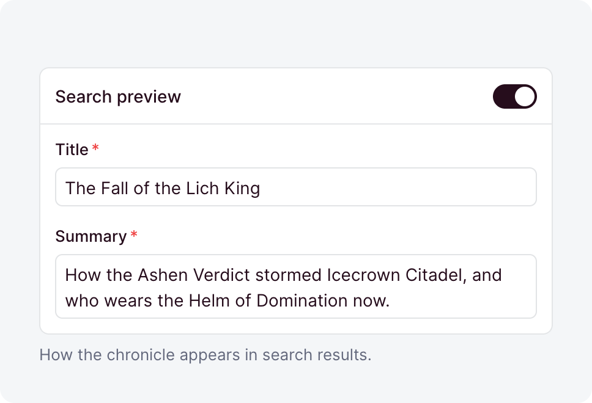
</picture>

One nested [group of fields](./collections.md#composite-fields), stored in its own table. A record
holds one group or none.

| Option         | Default  | What it does                                                                                                                                                            |
| -------------- | -------- | ----------------------------------------------------------------------------------------------------------------------------------------------------------------------- |
| `default`      | -        | A function that returns the group a [create](./writing.md#defaults) stores when its input leaves the field out.                                                         |
| `description`  | -        | Help text below the label, as markdown. A string, a [message key](../i18n/messages.md), or an [object](./collections.md#dashboard-appearance) that starts it collapsed. |
| `fields`       | required | The subfields, each a `field(...)`.                                                                                                                                     |
| `immutable`    | `false`  | Locks the field after create: creates accept it, updates reject it. Top-level collection fields only.                                                                   |
| `label`        | -        | The label the dashboard shows, as a string or a [message key](../i18n/messages.md). Omitted, the field name is sentence-cased.                                          |
| `layout`       | -        | How the editor [arranges the subfields](../dashboard/field-layouts.md). Omitted, they stack in order.                                                                   |
| `readable`     | `true`   | `false` makes the field [write-only](./collections.md#write-only-and-locked-fields): no read returns it.                                                                |
| `sanitizers`   | -        | Functions that [clean the value](./writing.md#sanitizers-and-validators) before it is validated.                                                                        |
| `search`       | `true`   | `false` keeps [search](./collections.md#search) from looking inside the object.                                                                                         |
| `translatable` | `false`  | Keeps [one group per locale](./translations.md#marking-fields). Top-level collection fields only.                                                                       |
| `validators`   | -        | Functions that [reject a value](./writing.md#sanitizers-and-validators) by returning a message.                                                                         |
| `when`         | -        | A [condition](./conditional-fields.md) that turns the field on or off per record.                                                                                       |
| `writable`     | `true`   | `false` removes the field from write inputs, so its value comes from `default`.                                                                                         |

### `record`

<picture>
  <source media="(prefers-color-scheme: dark)" srcset="../images/field-types/record-dark.png">
  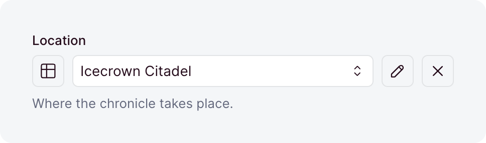
</picture>

A [reference](./collections.md#one-reference) to one record of another collection, stored as its
`UUID`. It is always nullable and always indexed, so no option makes it required.

| Option            | Default     | What it does                                                                                                                                                            |
| ----------------- | ----------- | ----------------------------------------------------------------------------------------------------------------------------------------------------------------------- |
| `collection`      | required    | The collection the field references.                                                                                                                                    |
| `default`         | -           | The value a [create](./writing.md#defaults) stores when its input leaves the field out. A value, or a function that computes one.                                       |
| `description`     | -           | Help text below the label, as markdown. A string, a [message key](../i18n/messages.md), or an [object](./collections.md#dashboard-appearance) that starts it collapsed. |
| `immutable`       | `false`     | Locks the field after create: creates accept it, updates reject it. Top-level collection fields only.                                                                   |
| `label`           | -           | The label the dashboard shows, as a string or a [message key](../i18n/messages.md). Omitted, the field name is sentence-cased.                                          |
| `onDelete`        | `'setNull'` | What happens when the target is deleted: `'setNull'` clears the reference, `'cascade'` deletes this row, and `'restrict'` blocks the delete.                            |
| `readable`        | `true`      | `false` makes the field [write-only](./collections.md#write-only-and-locked-fields): no read returns it.                                                                |
| `sanitizers`      | -           | Functions that [clean the value](./writing.md#sanitizers-and-validators) before it is validated.                                                                        |
| `search`          | `true`      | `false` stops [search](./collections.md#search) from finding records through this link.                                                                                 |
| `translatable`    | `false`     | Keeps [one reference per locale](./translations.md#marking-fields). Top-level collection fields only.                                                                   |
| `unique`          | `false`     | Lets at most one row reference each target, for a one-to-one relation.                                                                                                  |
| `uniquePerLocale` | `false`     | Limits `unique` to one locale. Needs `unique` and `translatable`.                                                                                                       |
| `uniquePerParent` | `false`     | Limits `unique` to each record's own list, inside a repeater. Needs `unique`.                                                                                           |
| `validators`      | -           | Functions that [reject a value](./writing.md#sanitizers-and-validators) by returning a message.                                                                         |
| `when`            | -           | A [condition](./conditional-fields.md) that turns the field on or off per record.                                                                                       |
| `writable`        | `true`      | `false` removes the field from write inputs, so its value comes from `default`.                                                                                         |

### `records`

<picture>
  <source media="(prefers-color-scheme: dark)" srcset="../images/field-types/records-dark.png">
  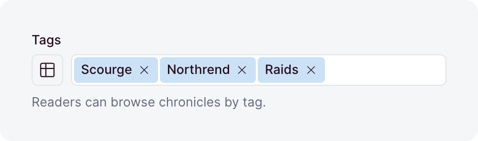
</picture>

An ordered list of [references](./collections.md#many-references) to records of another collection,
stored in a junction table. A list that names the same `UUID` twice is rejected.

| Option         | Default     | What it does                                                                                                                                                            |
| -------------- | ----------- | ----------------------------------------------------------------------------------------------------------------------------------------------------------------------- |
| `allowEmpty`   | `true`      | Accepts an empty list. With `false`, a written `[]` is rejected, so the field needs at least one link.                                                                  |
| `collection`   | required    | The collection the field references.                                                                                                                                    |
| `default`      | `[]`        | A function that returns the list a [create](./writing.md#defaults) stores when its input leaves the field out.                                                          |
| `description`  | -           | Help text below the label, as markdown. A string, a [message key](../i18n/messages.md), or an [object](./collections.md#dashboard-appearance) that starts it collapsed. |
| `immutable`    | `false`     | Locks the field after create: creates accept it, updates reject it. Top-level collection fields only.                                                                   |
| `inverse`      | -           | The owning `records` field on the target collection. This field then [shares its junction](./collections.md#both-sides-of-a-relation).                                  |
| `label`        | -           | The label the dashboard shows, as a string or a [message key](../i18n/messages.md). Omitted, the field name is sentence-cased.                                          |
| `max`          | -           | The most links a written list may hold.                                                                                                                                 |
| `min`          | -           | The fewest links a written list may hold.                                                                                                                               |
| `onDelete`     | `'cascade'` | What happens to a link when its target is deleted: `'cascade'` removes the link, and `'restrict'` blocks the delete. Not on an `inverse` field.                         |
| `readable`     | `true`      | `false` makes the field [write-only](./collections.md#write-only-and-locked-fields): no read returns it.                                                                |
| `sanitizers`   | -           | Functions that [clean the value](./writing.md#sanitizers-and-validators) before it is validated.                                                                        |
| `search`       | `true`      | `false` stops [search](./collections.md#search) from finding records through these links. Off by default on an `inverse` field.                                         |
| `translatable` | `false`     | Keeps [one list per locale](./translations.md#marking-fields). Top-level collection fields only, and not on an `inverse` field.                                         |
| `validators`   | -           | Functions that [reject a value](./writing.md#sanitizers-and-validators) by returning a message.                                                                         |
| `when`         | -           | A [condition](./conditional-fields.md) that turns the field on or off per record.                                                                                       |
| `writable`     | `true`      | `false` removes the field from write inputs, so its value comes from `default`.                                                                                         |

### `repeater`

<picture>
  <source media="(prefers-color-scheme: dark)" srcset="../images/field-types/repeater-dark.png">
  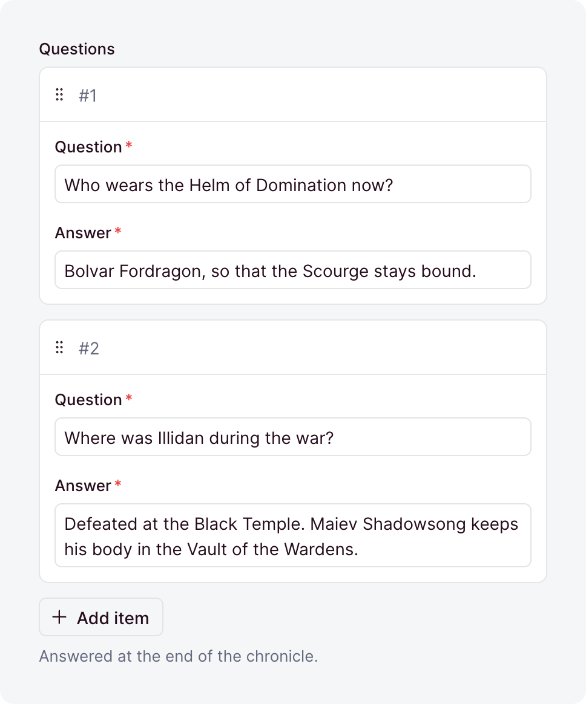
</picture>

An ordered list of nested [groups of fields](./collections.md#composite-fields), stored in its own
table. Every item keeps its own `UUID`.

| Option         | Default  | What it does                                                                                                                                                            |
| -------------- | -------- | ----------------------------------------------------------------------------------------------------------------------------------------------------------------------- |
| `allowEmpty`   | `true`   | Accepts an empty list. With `false`, a written `[]` is rejected, so the field needs at least one item.                                                                  |
| `default`      | `[]`     | A function that returns the list a [create](./writing.md#defaults) stores when its input leaves the field out.                                                          |
| `description`  | -        | Help text below the label, as markdown. A string, a [message key](../i18n/messages.md), or an [object](./collections.md#dashboard-appearance) that starts it collapsed. |
| `fields`       | required | The fields of one item, each a `field(...)`.                                                                                                                            |
| `immutable`    | `false`  | Locks the field after create: creates accept it, updates reject it. Top-level collection fields only.                                                                   |
| `label`        | -        | The label the dashboard shows, as a string or a [message key](../i18n/messages.md). Omitted, the field name is sentence-cased.                                          |
| `layout`       | -        | How the editor [arranges the fields](../dashboard/field-layouts.md) of an item. Omitted, they stack in order.                                                           |
| `max`          | -        | The most items a written list may hold.                                                                                                                                 |
| `min`          | -        | The fewest items a written list may hold.                                                                                                                               |
| `readable`     | `true`   | `false` makes the field [write-only](./collections.md#write-only-and-locked-fields): no read returns it.                                                                |
| `sanitizers`   | -        | Functions that [clean the value](./writing.md#sanitizers-and-validators) before it is validated.                                                                        |
| `search`       | `true`   | `false` keeps [search](./collections.md#search) from looking inside the items.                                                                                          |
| `translatable` | `false`  | Keeps [one list per locale](./translations.md#marking-fields). Top-level collection fields only.                                                                        |
| `validators`   | -        | Functions that [reject a value](./writing.md#sanitizers-and-validators) by returning a message.                                                                         |
| `when`         | -        | A [condition](./conditional-fields.md) that turns the field on or off per record.                                                                                       |
| `writable`     | `true`   | `false` removes the field from write inputs, so its value comes from `default`.                                                                                         |

### `richText`

<picture>
  <source media="(prefers-color-scheme: dark)" srcset="../images/field-types/rich-text-dark.png">
  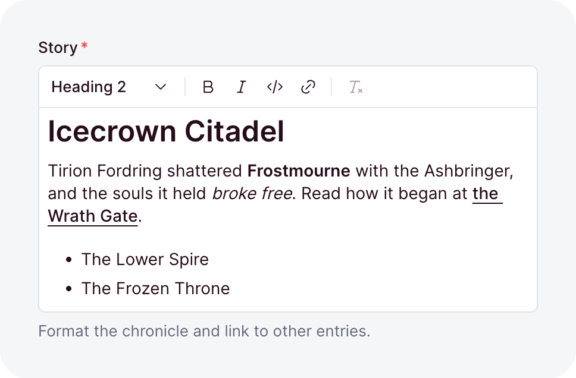
</picture>

Formatted text with links, stored as a JSON tree. [Rich text](./rich-text.md) covers its value,
links, rendering and editing.

| Option            | Default                                  | What it does                                                                                                                                                            |
| ----------------- | ---------------------------------------- | ----------------------------------------------------------------------------------------------------------------------------------------------------------------------- |
| `allowEmpty`      | `false`                                  | Accepts the empty value `[]`.                                                                                                                                           |
| `default`         | -                                        | The value a [create](./writing.md#defaults) stores when its input leaves the field out. A value, or a function that computes one.                                       |
| `description`     | -                                        | Help text below the label, as markdown. A string, a [message key](../i18n/messages.md), or an [object](./collections.md#dashboard-appearance) that starts it collapsed. |
| `elements`        | `['h2', 'h3', 'ul', 'ol', 'blockquote']` | The block elements allowed besides paragraphs: `h2` to `h6`, `ul`, `ol` and `blockquote`.                                                                               |
| `immutable`       | `false`                                  | Locks the field after create: creates accept it, updates reject it. Top-level collection fields only.                                                                   |
| `index`           | `false`                                  | Adds an index on the column, for faster lookups.                                                                                                                        |
| `inline`          | `false`                                  | Holds at most one paragraph, rendered without a `<p>`. `elements` does not apply.                                                                                       |
| `label`           | -                                        | The label the dashboard shows, as a string or a [message key](../i18n/messages.md). Omitted, the field name is sentence-cased.                                          |
| `lineBreaks`      | `true`                                   | With `false`, each `\n` becomes a space.                                                                                                                                |
| `links`           | `true`                                   | `false` allows no links, `true` allows addresses, and a list of collections also allows [their records](./rich-text.md#links).                                          |
| `marks`           | `['strong', 'em', 'code']`               | The marks allowed on text. `del` is strikethrough.                                                                                                                      |
| `max`             | -                                        | The most characters the run text may hold, counted like `String#length`.                                                                                                |
| `min`             | -                                        | The fewest characters the run text may hold, counted the same way.                                                                                                      |
| `nullable`        | `false`                                  | Lets the field hold `null`.                                                                                                                                             |
| `placeholder`     | -                                        | The hint an empty editor shows, as a string or a [message key](../i18n/messages.md).                                                                                    |
| `readable`        | `true`                                   | `false` makes the field [write-only](./collections.md#write-only-and-locked-fields): no read returns it.                                                                |
| `sanitizers`      | -                                        | Functions that [clean the value](./writing.md#sanitizers-and-validators) before it is validated.                                                                        |
| `search`          | `false`                                  | Locked: [search](./collections.md#search) never matches rich text, and `true` fails at boot.                                                                            |
| `translatable`    | `false`                                  | Keeps [one value per locale](./translations.md#marking-fields). Top-level collection fields only.                                                                       |
| `unique`          | `false`                                  | Rejects a value that another row already holds.                                                                                                                         |
| `uniquePerLocale` | `false`                                  | Limits `unique` to one locale. Needs `unique` and `translatable`.                                                                                                       |
| `uniquePerParent` | `false`                                  | Limits `unique` to each record's own list, inside a repeater. Needs `unique`.                                                                                           |
| `validators`      | -                                        | Functions that [reject a value](./writing.md#sanitizers-and-validators) by returning a message.                                                                         |
| `when`            | -                                        | A [condition](./conditional-fields.md) that turns the field on or off per record.                                                                                       |
| `writable`        | `true`                                   | `false` removes the field from write inputs, so its value comes from `default`.                                                                                         |

### `select`

<picture>
  <source media="(prefers-color-scheme: dark)" srcset="../images/field-types/select-dark.png">
  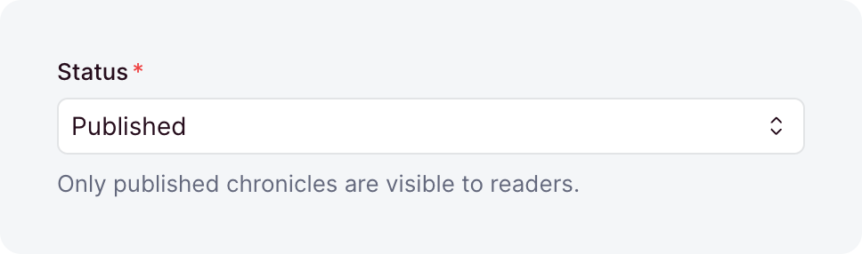
</picture>

One value out of a list you declare. The record type narrows to that union, and a value outside the
list is rejected.

| Option            | Default  | What it does                                                                                                                                                            |
| ----------------- | -------- | ----------------------------------------------------------------------------------------------------------------------------------------------------------------------- |
| `choices`         | required | The values the field accepts. Each is a string, or `{ value, label }` with a label the dashboard shows.                                                                 |
| `default`         | -        | The value a [create](./writing.md#defaults) stores when its input leaves the field out. A value, or a function that computes one.                                       |
| `description`     | -        | Help text below the label, as markdown. A string, a [message key](../i18n/messages.md), or an [object](./collections.md#dashboard-appearance) that starts it collapsed. |
| `immutable`       | `false`  | Locks the field after create: creates accept it, updates reject it. Top-level collection fields only.                                                                   |
| `index`           | `false`  | Adds an index on the column, for faster lookups.                                                                                                                        |
| `label`           | -        | The label the dashboard shows, as a string or a [message key](../i18n/messages.md). Omitted, the field name is sentence-cased.                                          |
| `nullable`        | `false`  | Lets the field hold `null`.                                                                                                                                             |
| `placeholder`     | -        | The hint an empty input shows, as a string or a [message key](../i18n/messages.md).                                                                                     |
| `readable`        | `true`   | `false` makes the field [write-only](./collections.md#write-only-and-locked-fields): no read returns it.                                                                |
| `sanitizers`      | -        | Functions that [clean the value](./writing.md#sanitizers-and-validators) before it is validated.                                                                        |
| `search`          | `true`   | Lets [search](./collections.md#search) match the field by a word of a choice's value or label, like `pub` for `Published`.                                              |
| `translatable`    | `false`  | Keeps [one value per locale](./translations.md#marking-fields). Top-level collection fields only.                                                                       |
| `unique`          | `false`  | Rejects a value that another row already holds.                                                                                                                         |
| `uniquePerLocale` | `false`  | Limits `unique` to one locale. Needs `unique` and `translatable`.                                                                                                       |
| `uniquePerParent` | `false`  | Limits `unique` to each record's own list, inside a repeater. Needs `unique`.                                                                                           |
| `validators`      | -        | Functions that [reject a value](./writing.md#sanitizers-and-validators) by returning a message.                                                                         |
| `when`            | -        | A [condition](./conditional-fields.md) that turns the field on or off per record.                                                                                       |
| `writable`        | `true`   | `false` removes the field from write inputs, so its value comes from `default`.                                                                                         |

### `text`

<picture>
  <source media="(prefers-color-scheme: dark)" srcset="../images/field-types/text-dark.png">
  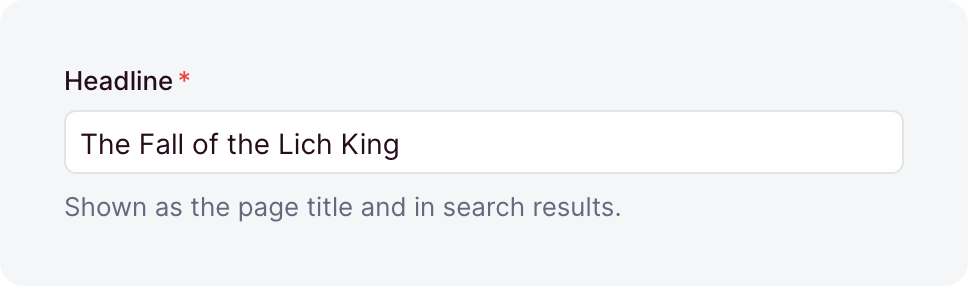
</picture>

A string. It rejects the empty string unless `allowEmpty` is set.

| Option            | Default | What it does                                                                                                                                                            |
| ----------------- | ------- | ----------------------------------------------------------------------------------------------------------------------------------------------------------------------- |
| `allowEmpty`      | `false` | Accepts the empty string `''`.                                                                                                                                          |
| `default`         | -       | The value a [create](./writing.md#defaults) stores when its input leaves the field out. A value, or a function that computes one.                                       |
| `description`     | -       | Help text below the label, as markdown. A string, a [message key](../i18n/messages.md), or an [object](./collections.md#dashboard-appearance) that starts it collapsed. |
| `immutable`       | `false` | Locks the field after create: creates accept it, updates reject it. Top-level collection fields only.                                                                   |
| `index`           | `false` | Adds an index on the column, for faster lookups.                                                                                                                        |
| `label`           | -       | The label the dashboard shows, as a string or a [message key](../i18n/messages.md). Omitted, the field name is sentence-cased.                                          |
| `max`             | -       | The most characters a value may hold, counted like `String#length`, so an emoji counts as 2.                                                                            |
| `min`             | -       | The fewest characters a value may hold, counted the same way.                                                                                                           |
| `multiline`       | `false` | Edits the value in a text area. The stored value is the same either way.                                                                                                |
| `nullable`        | `false` | Lets the field hold `null`.                                                                                                                                             |
| `placeholder`     | -       | The hint an empty input shows, as a string or a [message key](../i18n/messages.md).                                                                                     |
| `readable`        | `true`  | `false` makes the field [write-only](./collections.md#write-only-and-locked-fields): no read returns it.                                                                |
| `sanitizers`      | -       | Functions that [clean the value](./writing.md#sanitizers-and-validators) before it is validated.                                                                        |
| `search`          | `true`  | Lets [search](./collections.md#search) match any value that contains the typed word.                                                                                    |
| `translatable`    | `false` | Keeps [one value per locale](./translations.md#marking-fields). Top-level collection fields only.                                                                       |
| `unique`          | `false` | Rejects a value that another row already holds.                                                                                                                         |
| `uniquePerLocale` | `false` | Limits `unique` to one locale. Needs `unique` and `translatable`.                                                                                                       |
| `uniquePerParent` | `false` | Limits `unique` to each record's own list, inside a repeater. Needs `unique`.                                                                                           |
| `validators`      | -       | Functions that [reject a value](./writing.md#sanitizers-and-validators) by returning a message.                                                                         |
| `when`            | -       | A [condition](./conditional-fields.md) that turns the field on or off per record.                                                                                       |
| `writable`        | `true`  | `false` removes the field from write inputs, so its value comes from `default`.                                                                                         |

### `time`

<picture>
  <source media="(prefers-color-scheme: dark)" srcset="../images/field-types/time-dark.png">
  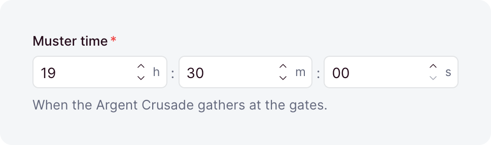
</picture>

A time of day, stored as `HH:MM:SS` text. `HH:MM` input is stored with `:00` seconds.

| Option            | Default | What it does                                                                                                                                                            |
| ----------------- | ------- | ----------------------------------------------------------------------------------------------------------------------------------------------------------------------- |
| `default`         | -       | The value a [create](./writing.md#defaults) stores when its input leaves the field out. A value, or a function that computes one.                                       |
| `description`     | -       | Help text below the label, as markdown. A string, a [message key](../i18n/messages.md), or an [object](./collections.md#dashboard-appearance) that starts it collapsed. |
| `immutable`       | `false` | Locks the field after create: creates accept it, updates reject it. Top-level collection fields only.                                                                   |
| `index`           | `false` | Adds an index on the column, for faster lookups.                                                                                                                        |
| `label`           | -       | The label the dashboard shows, as a string or a [message key](../i18n/messages.md). Omitted, the field name is sentence-cased.                                          |
| `max`             | -       | The latest time, as `HH:MM:SS` or `HH:MM`.                                                                                                                              |
| `min`             | -       | The earliest time, as `HH:MM:SS` or `HH:MM`.                                                                                                                            |
| `nullable`        | `false` | Lets the field hold `null`.                                                                                                                                             |
| `readable`        | `true`  | `false` makes the field [write-only](./collections.md#write-only-and-locked-fields): no read returns it.                                                                |
| `sanitizers`      | -       | Functions that [clean the value](./writing.md#sanitizers-and-validators) before it is validated.                                                                        |
| `search`          | `true`  | Lets [search](./collections.md#search) match the field. A time like `10:30` finds the times that start with it.                                                         |
| `translatable`    | `false` | Keeps [one value per locale](./translations.md#marking-fields). Top-level collection fields only.                                                                       |
| `unique`          | `false` | Rejects a value that another row already holds.                                                                                                                         |
| `uniquePerLocale` | `false` | Limits `unique` to one locale. Needs `unique` and `translatable`.                                                                                                       |
| `uniquePerParent` | `false` | Limits `unique` to each record's own list, inside a repeater. Needs `unique`.                                                                                           |
| `validators`      | -       | Functions that [reject a value](./writing.md#sanitizers-and-validators) by returning a message.                                                                         |
| `when`            | -       | A [condition](./conditional-fields.md) that turns the field on or off per record.                                                                                       |
| `writable`        | `true`  | `false` removes the field from write inputs, so its value comes from `default`.                                                                                         |

## Base layer types

The [`ohnejs/base`](../project/layers.md#what-the-base-layer-ships) layer ships the types its
`Users` collection is built from. Any collection can use them while your app stacks the layer.

### `datePattern`

<picture>
  <source media="(prefers-color-scheme: dark)" srcset="../images/field-types/date-pattern-dark.png">
  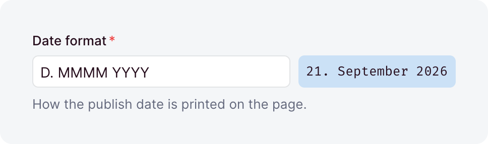
</picture>

A date or time [format pattern](../dashboard/account.md#format-tokens), like `YYYY-MM-DD`. It holds
at most 64 characters and may not be blank.

| Option            | Default | What it does                                                                                                                                                            |
| ----------------- | ------- | ----------------------------------------------------------------------------------------------------------------------------------------------------------------------- |
| `default`         | -       | The value a [create](./writing.md#defaults) stores when its input leaves the field out. A value, or a function that computes one.                                       |
| `description`     | -       | Help text below the label, as markdown. A string, a [message key](../i18n/messages.md), or an [object](./collections.md#dashboard-appearance) that starts it collapsed. |
| `immutable`       | `false` | Locks the field after create: creates accept it, updates reject it. Top-level collection fields only.                                                                   |
| `index`           | `false` | Adds an index on the column, for faster lookups.                                                                                                                        |
| `label`           | -       | The label the dashboard shows, as a string or a [message key](../i18n/messages.md). Omitted, the field name is sentence-cased.                                          |
| `nullable`        | `false` | Lets the field hold `null`.                                                                                                                                             |
| `placeholder`     | -       | The hint an empty input shows, as a string or a [message key](../i18n/messages.md).                                                                                     |
| `readable`        | `true`  | `false` makes the field [write-only](./collections.md#write-only-and-locked-fields): no read returns it.                                                                |
| `sanitizers`      | -       | Functions that [clean the value](./writing.md#sanitizers-and-validators) before it is validated.                                                                        |
| `search`          | `false` | `true` lets [search](./collections.md#search) match any value that contains the typed word.                                                                             |
| `translatable`    | `false` | Keeps [one value per locale](./translations.md#marking-fields). Top-level collection fields only.                                                                       |
| `unique`          | `false` | Rejects a value that another row already holds.                                                                                                                         |
| `uniquePerLocale` | `false` | Limits `unique` to one locale. Needs `unique` and `translatable`.                                                                                                       |
| `uniquePerParent` | `false` | Limits `unique` to each record's own list, inside a repeater. Needs `unique`.                                                                                           |
| `validators`      | -       | Functions that [reject a value](./writing.md#sanitizers-and-validators) by returning a message.                                                                         |
| `when`            | -       | A [condition](./conditional-fields.md) that turns the field on or off per record.                                                                                       |
| `writable`        | `true`  | `false` removes the field from write inputs, so its value comes from `default`.                                                                                         |

### `language`

<picture>
  <source media="(prefers-color-scheme: dark)" srcset="../images/field-types/language-dark.png">
  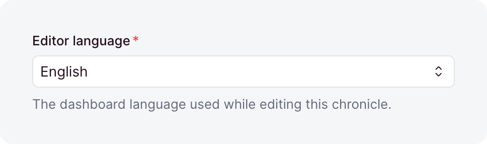
</picture>

A dashboard language, stored as its canonical BCP-47 tag, so `de-at` is stored as `de-AT`. Only a
language that has a [message catalog](../i18n/messages.md#catalogs) is accepted.

| Option            | Default | What it does                                                                                                                                                            |
| ----------------- | ------- | ----------------------------------------------------------------------------------------------------------------------------------------------------------------------- |
| `default`         | -       | The value a [create](./writing.md#defaults) stores when its input leaves the field out. A value, or a function that computes one.                                       |
| `description`     | -       | Help text below the label, as markdown. A string, a [message key](../i18n/messages.md), or an [object](./collections.md#dashboard-appearance) that starts it collapsed. |
| `immutable`       | `false` | Locks the field after create: creates accept it, updates reject it. Top-level collection fields only.                                                                   |
| `index`           | `false` | Adds an index on the column, for faster lookups.                                                                                                                        |
| `label`           | -       | The label the dashboard shows, as a string or a [message key](../i18n/messages.md). Omitted, the field name is sentence-cased.                                          |
| `nullable`        | `false` | Lets the field hold `null`.                                                                                                                                             |
| `placeholder`     | -       | The hint an empty input shows, as a string or a [message key](../i18n/messages.md).                                                                                     |
| `readable`        | `true`  | `false` makes the field [write-only](./collections.md#write-only-and-locked-fields): no read returns it.                                                                |
| `sanitizers`      | -       | Functions that [clean the value](./writing.md#sanitizers-and-validators) before it is validated.                                                                        |
| `search`          | `false` | `true` lets [search](./collections.md#search) match any value that contains the typed word.                                                                             |
| `translatable`    | `false` | Keeps [one value per locale](./translations.md#marking-fields). Top-level collection fields only.                                                                       |
| `unique`          | `false` | Rejects a value that another row already holds.                                                                                                                         |
| `uniquePerLocale` | `false` | Limits `unique` to one locale. Needs `unique` and `translatable`.                                                                                                       |
| `uniquePerParent` | `false` | Limits `unique` to each record's own list, inside a repeater. Needs `unique`.                                                                                           |
| `validators`      | -       | Functions that [reject a value](./writing.md#sanitizers-and-validators) by returning a message.                                                                         |
| `when`            | -       | A [condition](./conditional-fields.md) that turns the field on or off per record.                                                                                       |
| `writable`        | `true`  | `false` removes the field from write inputs, so its value comes from `default`.                                                                                         |

### `locale`

<picture>
  <source media="(prefers-color-scheme: dark)" srcset="../images/field-types/locale-dark.png">
  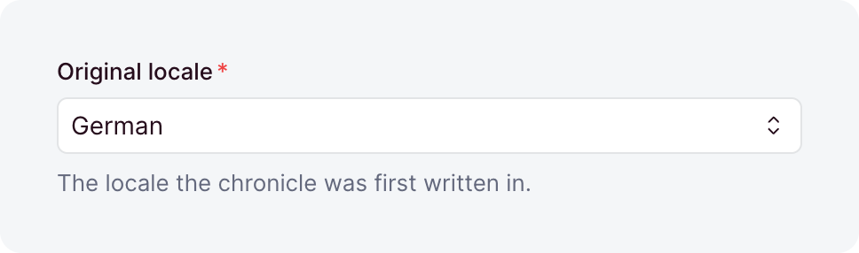
</picture>

One of your [content locales](../project/config.md#content-locales), as its canonical tag like
`de-AT`. The tag must arrive in that form: `de-at` is rejected.

| Option            | Default | What it does                                                                                                                                                            |
| ----------------- | ------- | ----------------------------------------------------------------------------------------------------------------------------------------------------------------------- |
| `default`         | -       | The value a [create](./writing.md#defaults) stores when its input leaves the field out. A value, or a function that computes one.                                       |
| `description`     | -       | Help text below the label, as markdown. A string, a [message key](../i18n/messages.md), or an [object](./collections.md#dashboard-appearance) that starts it collapsed. |
| `immutable`       | `false` | Locks the field after create: creates accept it, updates reject it. Top-level collection fields only.                                                                   |
| `index`           | `false` | Adds an index on the column, for faster lookups.                                                                                                                        |
| `label`           | -       | The label the dashboard shows, as a string or a [message key](../i18n/messages.md). Omitted, the field name is sentence-cased.                                          |
| `nullable`        | `false` | Lets the field hold `null`.                                                                                                                                             |
| `placeholder`     | -       | The hint an empty input shows, as a string or a [message key](../i18n/messages.md).                                                                                     |
| `readable`        | `true`  | `false` makes the field [write-only](./collections.md#write-only-and-locked-fields): no read returns it.                                                                |
| `sanitizers`      | -       | Functions that [clean the value](./writing.md#sanitizers-and-validators) before it is validated.                                                                        |
| `search`          | `false` | `true` lets [search](./collections.md#search) match any value that contains the typed word.                                                                             |
| `translatable`    | `false` | Keeps [one value per locale](./translations.md#marking-fields). Top-level collection fields only.                                                                       |
| `unique`          | `false` | Rejects a value that another row already holds.                                                                                                                         |
| `uniquePerLocale` | `false` | Limits `unique` to one locale. Needs `unique` and `translatable`.                                                                                                       |
| `uniquePerParent` | `false` | Limits `unique` to each record's own list, inside a repeater. Needs `unique`.                                                                                           |
| `validators`      | -       | Functions that [reject a value](./writing.md#sanitizers-and-validators) by returning a message.                                                                         |
| `when`            | -       | A [condition](./conditional-fields.md) that turns the field on or off per record.                                                                                       |
| `writable`        | `true`  | `false` removes the field from write inputs, so its value comes from `default`.                                                                                         |

### `password`

<picture>
  <source media="(prefers-color-scheme: dark)" srcset="../images/field-types/password-dark.png">
  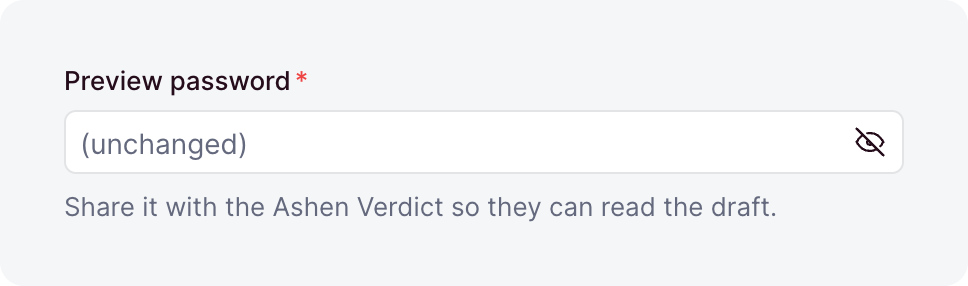
</picture>

Takes a plain-text password and stores its scrypt hash. Sanitizers and validators see the plain
text, so a policy like a minimum length goes in a validator. Pass
[`readable: false`](./collections.md#write-only-and-locked-fields), or reads return the hash.

| Option            | Default | What it does                                                                                                                                                            |
| ----------------- | ------- | ----------------------------------------------------------------------------------------------------------------------------------------------------------------------- |
| `default`         | -       | The value a [create](./writing.md#defaults) stores when its input leaves the field out. A value, or a function that computes one.                                       |
| `description`     | -       | Help text below the label, as markdown. A string, a [message key](../i18n/messages.md), or an [object](./collections.md#dashboard-appearance) that starts it collapsed. |
| `immutable`       | `false` | Locks the field after create: creates accept it, updates reject it. Top-level collection fields only.                                                                   |
| `index`           | `false` | Adds an index on the column, for faster lookups.                                                                                                                        |
| `label`           | -       | The label the dashboard shows, as a string or a [message key](../i18n/messages.md). Omitted, the field name is sentence-cased.                                          |
| `nullable`        | `false` | Lets the field hold `null`.                                                                                                                                             |
| `readable`        | `true`  | `false` makes the field [write-only](./collections.md#write-only-and-locked-fields): no read returns it.                                                                |
| `sanitizers`      | -       | Functions that [clean the value](./writing.md#sanitizers-and-validators) before it is validated.                                                                        |
| `search`          | `false` | Locked: [search](./collections.md#search) never matches a password, and `true` fails at boot.                                                                           |
| `translatable`    | `false` | Keeps [one value per locale](./translations.md#marking-fields). Top-level collection fields only.                                                                       |
| `unique`          | `false` | Rejects a value that another row already holds.                                                                                                                         |
| `uniquePerLocale` | `false` | Limits `unique` to one locale. Needs `unique` and `translatable`.                                                                                                       |
| `uniquePerParent` | `false` | Limits `unique` to each record's own list, inside a repeater. Needs `unique`.                                                                                           |
| `validators`      | -       | Functions that [reject a value](./writing.md#sanitizers-and-validators) by returning a message.                                                                         |
| `when`            | -       | A [condition](./conditional-fields.md) that turns the field on or off per record.                                                                                       |
| `writable`        | `true`  | `false` removes the field from write inputs, so its value comes from `default`.                                                                                         |

### `roles`

<picture>
  <source media="(prefers-color-scheme: dark)" srcset="../images/field-types/roles-dark.png">
  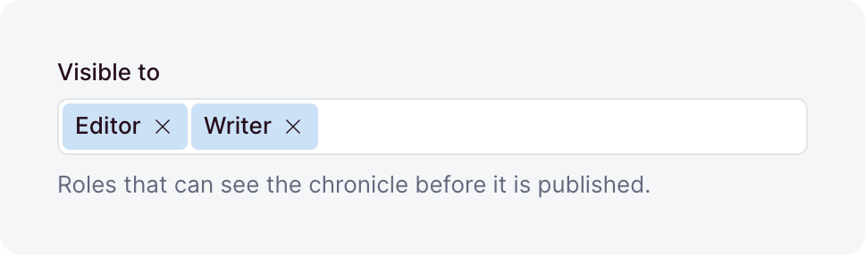
</picture>

A list of [role names](../auth/roles.md#assigning-roles), stored as a JSON list. Each entry must
name a defined role, and duplicates are removed on write.

| Option            | Default | What it does                                                                                                                                                            |
| ----------------- | ------- | ----------------------------------------------------------------------------------------------------------------------------------------------------------------------- |
| `default`         | `[]`    | The list a [create](./writing.md#defaults) stores when its input leaves the field out. A value, or a function that computes one.                                        |
| `description`     | -       | Help text below the label, as markdown. A string, a [message key](../i18n/messages.md), or an [object](./collections.md#dashboard-appearance) that starts it collapsed. |
| `immutable`       | `false` | Locks the field after create: creates accept it, updates reject it. Top-level collection fields only.                                                                   |
| `index`           | `false` | Adds an index on the column, for faster lookups.                                                                                                                        |
| `label`           | -       | The label the dashboard shows, as a string or a [message key](../i18n/messages.md). Omitted, the field name is sentence-cased.                                          |
| `nullable`        | `false` | Lets the field hold `null`.                                                                                                                                             |
| `readable`        | `true`  | `false` makes the field [write-only](./collections.md#write-only-and-locked-fields): no read returns it.                                                                |
| `sanitizers`      | -       | Functions that [clean the value](./writing.md#sanitizers-and-validators) before it is validated.                                                                        |
| `search`          | `false` | `true` lets [search](./collections.md#search) find the holders of a role by its exact name.                                                                             |
| `translatable`    | `false` | Keeps [one value per locale](./translations.md#marking-fields). Top-level collection fields only.                                                                       |
| `unique`          | `false` | Rejects a value that another row already holds.                                                                                                                         |
| `uniquePerLocale` | `false` | Limits `unique` to one locale. Needs `unique` and `translatable`.                                                                                                       |
| `uniquePerParent` | `false` | Limits `unique` to each record's own list, inside a repeater. Needs `unique`.                                                                                           |
| `validators`      | -       | Functions that [reject a value](./writing.md#sanitizers-and-validators) by returning a message.                                                                         |
| `when`            | -       | A [condition](./conditional-fields.md) that turns the field on or off per record.                                                                                       |
| `writable`        | `true`  | `false` removes the field from write inputs, so its value comes from `default`.                                                                                         |

### `timezone`

<picture>
  <source media="(prefers-color-scheme: dark)" srcset="../images/field-types/timezone-dark.png">
  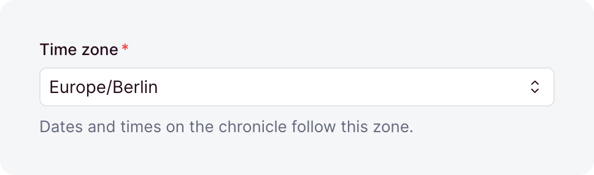
</picture>

An IANA time zone name, like `Europe/Berlin`.

| Option            | Default | What it does                                                                                                                                                            |
| ----------------- | ------- | ----------------------------------------------------------------------------------------------------------------------------------------------------------------------- |
| `default`         | -       | The value a [create](./writing.md#defaults) stores when its input leaves the field out. A value, or a function that computes one.                                       |
| `description`     | -       | Help text below the label, as markdown. A string, a [message key](../i18n/messages.md), or an [object](./collections.md#dashboard-appearance) that starts it collapsed. |
| `immutable`       | `false` | Locks the field after create: creates accept it, updates reject it. Top-level collection fields only.                                                                   |
| `index`           | `false` | Adds an index on the column, for faster lookups.                                                                                                                        |
| `label`           | -       | The label the dashboard shows, as a string or a [message key](../i18n/messages.md). Omitted, the field name is sentence-cased.                                          |
| `nullable`        | `false` | Lets the field hold `null`.                                                                                                                                             |
| `readable`        | `true`  | `false` makes the field [write-only](./collections.md#write-only-and-locked-fields): no read returns it.                                                                |
| `sanitizers`      | -       | Functions that [clean the value](./writing.md#sanitizers-and-validators) before it is validated.                                                                        |
| `search`          | `false` | `true` lets [search](./collections.md#search) match any value that contains the typed word.                                                                             |
| `translatable`    | `false` | Keeps [one value per locale](./translations.md#marking-fields). Top-level collection fields only.                                                                       |
| `unique`          | `false` | Rejects a value that another row already holds.                                                                                                                         |
| `uniquePerLocale` | `false` | Limits `unique` to one locale. Needs `unique` and `translatable`.                                                                                                       |
| `uniquePerParent` | `false` | Limits `unique` to each record's own list, inside a repeater. Needs `unique`.                                                                                           |
| `validators`      | -       | Functions that [reject a value](./writing.md#sanitizers-and-validators) by returning a message.                                                                         |
| `when`            | -       | A [condition](./conditional-fields.md) that turns the field on or off per record.                                                                                       |
| `writable`        | `true`  | `false` removes the field from write inputs, so its value comes from `default`.                                                                                         |

## Uploads layer types

The [uploads layer](../uploads/uploads.md) adds types that reference files in its `Uploads`
collection, and the name types that collection stores its files under.
[Media fields](../uploads/fields.md) covers how a write checks the references and how you read
them.

### `file`

<picture>
  <source media="(prefers-color-scheme: dark)" srcset="../images/field-types/file-dark.png">
  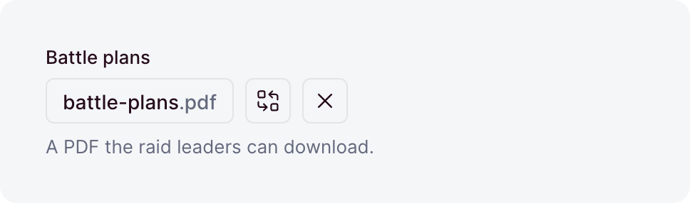
</picture>

A reference to one uploaded file, stored as its `UUID`. It is always nullable and always indexed,
so no option makes it required.

| Option            | Default     | What it does                                                                                                                                                            |
| ----------------- | ----------- | ----------------------------------------------------------------------------------------------------------------------------------------------------------------------- |
| `default`         | -           | The value a [create](./writing.md#defaults) stores when its input leaves the field out. A value, or a function that computes one.                                       |
| `description`     | -           | Help text below the label, as markdown. A string, a [message key](../i18n/messages.md), or an [object](./collections.md#dashboard-appearance) that starts it collapsed. |
| `immutable`       | `false`     | Locks the field after create: creates accept it, updates reject it. Top-level collection fields only.                                                                   |
| `label`           | -           | The label the dashboard shows, as a string or a [message key](../i18n/messages.md). Omitted, the field name is sentence-cased.                                          |
| `maxSize`         | -           | The largest file accepted, in bytes or as a size like `'5mb'`.                                                                                                          |
| `minSize`         | -           | The smallest file accepted, in bytes or as a size like `'10kb'`.                                                                                                        |
| `onDelete`        | `'setNull'` | What happens when the upload is deleted: `'setNull'` clears the reference, `'cascade'` deletes this row, and `'restrict'` blocks the delete.                            |
| `readable`        | `true`      | `false` makes the field [write-only](./collections.md#write-only-and-locked-fields): no read returns it.                                                                |
| `sanitizers`      | -           | Functions that [clean the value](./writing.md#sanitizers-and-validators) before it is validated.                                                                        |
| `search`          | `true`      | `false` stops [search](./collections.md#search) from finding records through this file.                                                                                 |
| `translatable`    | `false`     | Keeps [one reference per locale](./translations.md#marking-fields). Top-level collection fields only.                                                                   |
| `types`           | -           | The media types accepted, as exact types, wildcards, or [categories](../uploads/fields.md#types). Omitted, any file is accepted.                                        |
| `unique`          | `false`     | Lets at most one row reference each upload.                                                                                                                             |
| `uniquePerLocale` | `false`     | Limits `unique` to one locale. Needs `unique` and `translatable`.                                                                                                       |
| `uniquePerParent` | `false`     | Limits `unique` to each record's own list, inside a repeater. Needs `unique`.                                                                                           |
| `validators`      | -           | Functions that [reject a value](./writing.md#sanitizers-and-validators) by returning a message.                                                                         |
| `when`            | -           | A [condition](./conditional-fields.md) that turns the field on or off per record.                                                                                       |
| `writable`        | `true`      | `false` removes the field from write inputs, so its value comes from `default`.                                                                                         |

### `files`

<picture>
  <source media="(prefers-color-scheme: dark)" srcset="../images/field-types/files-dark.png">
  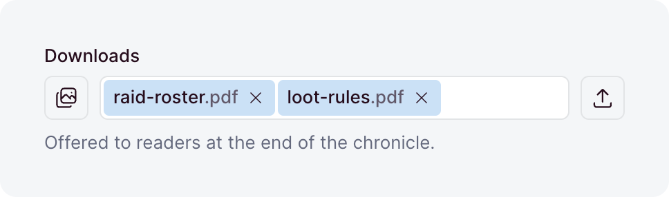
</picture>

An ordered list of references to uploaded files, stored in a junction table.

| Option         | Default     | What it does                                                                                                                                                            |
| -------------- | ----------- | ----------------------------------------------------------------------------------------------------------------------------------------------------------------------- |
| `allowEmpty`   | `true`      | Accepts an empty list. With `false`, a written `[]` is rejected, so the field needs at least one upload.                                                                |
| `default`      | `[]`        | A function that returns the list a [create](./writing.md#defaults) stores when its input leaves the field out.                                                          |
| `description`  | -           | Help text below the label, as markdown. A string, a [message key](../i18n/messages.md), or an [object](./collections.md#dashboard-appearance) that starts it collapsed. |
| `immutable`    | `false`     | Locks the field after create: creates accept it, updates reject it. Top-level collection fields only.                                                                   |
| `label`        | -           | The label the dashboard shows, as a string or a [message key](../i18n/messages.md). Omitted, the field name is sentence-cased.                                          |
| `max`          | -           | The most links a written list may hold.                                                                                                                                 |
| `maxSize`      | -           | The largest file accepted, in bytes or as a size like `'5mb'`.                                                                                                          |
| `min`          | -           | The fewest links a written list may hold.                                                                                                                               |
| `minSize`      | -           | The smallest file accepted, in bytes or as a size like `'10kb'`.                                                                                                        |
| `onDelete`     | `'cascade'` | What happens to a link when its upload is deleted: `'cascade'` removes the link, and `'restrict'` blocks the delete.                                                    |
| `placeholder`  | -           | The hint an empty input shows, as a string or a [message key](../i18n/messages.md).                                                                                     |
| `readable`     | `true`      | `false` makes the field [write-only](./collections.md#write-only-and-locked-fields): no read returns it.                                                                |
| `sanitizers`   | -           | Functions that [clean the value](./writing.md#sanitizers-and-validators) before it is validated.                                                                        |
| `search`       | `true`      | `false` stops [search](./collections.md#search) from finding records through these files.                                                                               |
| `translatable` | `false`     | Keeps [one list per locale](./translations.md#marking-fields). Top-level collection fields only.                                                                        |
| `types`        | -           | The media types accepted, as exact types, wildcards, or [categories](../uploads/fields.md#types). Omitted, any file is accepted.                                        |
| `validators`   | -           | Functions that [reject a value](./writing.md#sanitizers-and-validators) by returning a message.                                                                         |
| `when`         | -           | A [condition](./conditional-fields.md) that turns the field on or off per record.                                                                                       |
| `writable`     | `true`      | `false` removes the field from write inputs, so its value comes from `default`.                                                                                         |

### `image`

<picture>
  <source media="(prefers-color-scheme: dark)" srcset="../images/field-types/image-dark.png">
  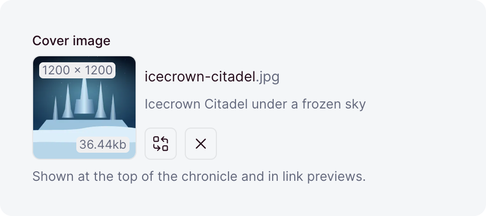
</picture>

A reference to one uploaded image, stored as its `UUID`. It is always nullable and always indexed,
so no option makes it required.

| Option            | Default     | What it does                                                                                                                                                            |
| ----------------- | ----------- | ----------------------------------------------------------------------------------------------------------------------------------------------------------------------- |
| `default`         | -           | The value a [create](./writing.md#defaults) stores when its input leaves the field out. A value, or a function that computes one.                                       |
| `description`     | -           | Help text below the label, as markdown. A string, a [message key](../i18n/messages.md), or an [object](./collections.md#dashboard-appearance) that starts it collapsed. |
| `immutable`       | `false`     | Locks the field after create: creates accept it, updates reject it. Top-level collection fields only.                                                                   |
| `label`           | -           | The label the dashboard shows, as a string or a [message key](../i18n/messages.md). Omitted, the field name is sentence-cased.                                          |
| `maxHeight`       | -           | The most pixels tall an accepted image is.                                                                                                                              |
| `maxSize`         | -           | The largest file accepted, in bytes or as a size like `'5mb'`.                                                                                                          |
| `maxWidth`        | -           | The most pixels wide an accepted image is.                                                                                                                              |
| `minHeight`       | -           | The fewest pixels tall an accepted image is.                                                                                                                            |
| `minSize`         | -           | The smallest file accepted, in bytes or as a size like `'10kb'`.                                                                                                        |
| `minWidth`        | -           | The fewest pixels wide an accepted image is.                                                                                                                            |
| `onDelete`        | `'setNull'` | What happens when the upload is deleted: `'setNull'` clears the reference, `'cascade'` deletes this row, and `'restrict'` blocks the delete.                            |
| `readable`        | `true`      | `false` makes the field [write-only](./collections.md#write-only-and-locked-fields): no read returns it.                                                                |
| `sanitizers`      | -           | Functions that [clean the value](./writing.md#sanitizers-and-validators) before it is validated.                                                                        |
| `search`          | `true`      | `false` stops [search](./collections.md#search) from finding records through this image.                                                                                |
| `translatable`    | `false`     | Keeps [one reference per locale](./translations.md#marking-fields). Top-level collection fields only.                                                                   |
| `types`           | `['image']` | The media types accepted, as exact types, wildcards, or [categories](../uploads/fields.md#types). The file must be an image either way.                                 |
| `unique`          | `false`     | Lets at most one row reference each upload.                                                                                                                             |
| `uniquePerLocale` | `false`     | Limits `unique` to one locale. Needs `unique` and `translatable`.                                                                                                       |
| `uniquePerParent` | `false`     | Limits `unique` to each record's own list, inside a repeater. Needs `unique`.                                                                                           |
| `validators`      | -           | Functions that [reject a value](./writing.md#sanitizers-and-validators) by returning a message.                                                                         |
| `when`            | -           | A [condition](./conditional-fields.md) that turns the field on or off per record.                                                                                       |
| `writable`        | `true`      | `false` removes the field from write inputs, so its value comes from `default`.                                                                                         |

### `images`

<picture>
  <source media="(prefers-color-scheme: dark)" srcset="../images/field-types/images-dark.png">
  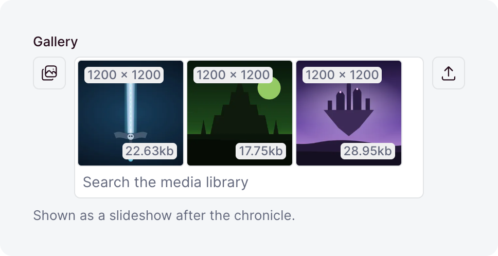
</picture>

An ordered list of references to uploaded images, stored in a junction table.

| Option         | Default     | What it does                                                                                                                                                            |
| -------------- | ----------- | ----------------------------------------------------------------------------------------------------------------------------------------------------------------------- |
| `allowEmpty`   | `true`      | Accepts an empty list. With `false`, a written `[]` is rejected, so the field needs at least one upload.                                                                |
| `default`      | `[]`        | A function that returns the list a [create](./writing.md#defaults) stores when its input leaves the field out.                                                          |
| `description`  | -           | Help text below the label, as markdown. A string, a [message key](../i18n/messages.md), or an [object](./collections.md#dashboard-appearance) that starts it collapsed. |
| `immutable`    | `false`     | Locks the field after create: creates accept it, updates reject it. Top-level collection fields only.                                                                   |
| `label`        | -           | The label the dashboard shows, as a string or a [message key](../i18n/messages.md). Omitted, the field name is sentence-cased.                                          |
| `max`          | -           | The most links a written list may hold.                                                                                                                                 |
| `maxHeight`    | -           | The most pixels tall an accepted image is.                                                                                                                              |
| `maxSize`      | -           | The largest file accepted, in bytes or as a size like `'5mb'`.                                                                                                          |
| `maxWidth`     | -           | The most pixels wide an accepted image is.                                                                                                                              |
| `min`          | -           | The fewest links a written list may hold.                                                                                                                               |
| `minHeight`    | -           | The fewest pixels tall an accepted image is.                                                                                                                            |
| `minSize`      | -           | The smallest file accepted, in bytes or as a size like `'10kb'`.                                                                                                        |
| `minWidth`     | -           | The fewest pixels wide an accepted image is.                                                                                                                            |
| `onDelete`     | `'cascade'` | What happens to a link when its upload is deleted: `'cascade'` removes the link, and `'restrict'` blocks the delete.                                                    |
| `placeholder`  | -           | The hint an empty input shows, as a string or a [message key](../i18n/messages.md).                                                                                     |
| `readable`     | `true`      | `false` makes the field [write-only](./collections.md#write-only-and-locked-fields): no read returns it.                                                                |
| `sanitizers`   | -           | Functions that [clean the value](./writing.md#sanitizers-and-validators) before it is validated.                                                                        |
| `search`       | `true`      | `false` stops [search](./collections.md#search) from finding records through these images.                                                                              |
| `translatable` | `false`     | Keeps [one list per locale](./translations.md#marking-fields). Top-level collection fields only.                                                                        |
| `types`        | `['image']` | The media types accepted, as exact types, wildcards, or [categories](../uploads/fields.md#types). The file must be an image either way.                                 |
| `validators`   | -           | Functions that [reject a value](./writing.md#sanitizers-and-validators) by returning a message.                                                                         |
| `when`         | -           | A [condition](./conditional-fields.md) that turns the field on or off per record.                                                                                       |
| `writable`     | `true`      | `false` removes the field from write inputs, so its value comes from `default`.                                                                                         |

### `fileName`

A [`text`](#text) value stored the way the uploads layer names files: `Sunset At Sea.JPG` becomes
`sunset-at-sea.jpg`. It takes every `text` option. Search reads a typed word the same way, so
`Übersicht` finds `ubersicht-q3-final.pdf`.

### `directoryName`

A [`text`](#text) value stored as a folder path: `Photos/2024 Summer` becomes
`photos/2024-summer`. It takes every `text` option, and search reads a typed word the same way.
